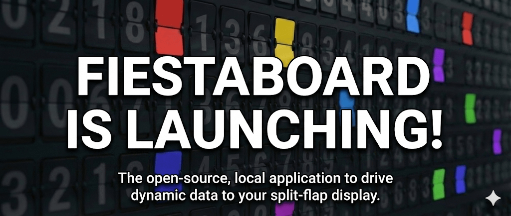
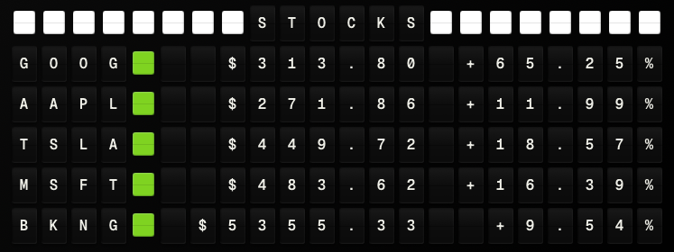
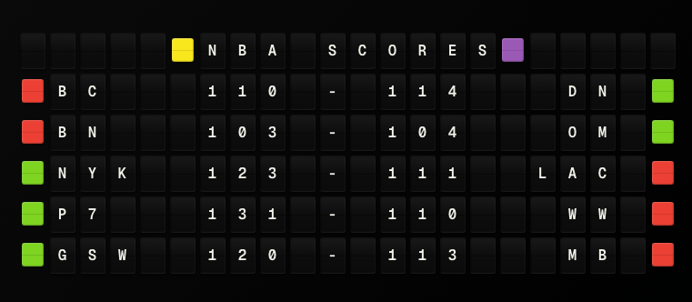
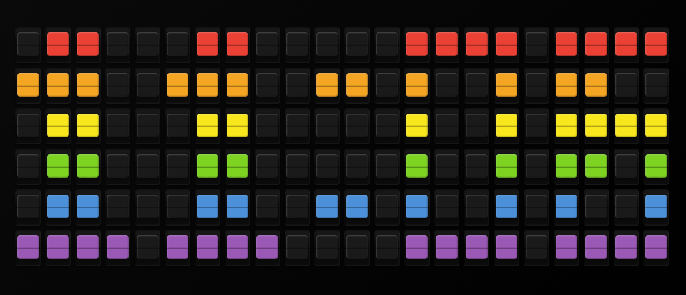
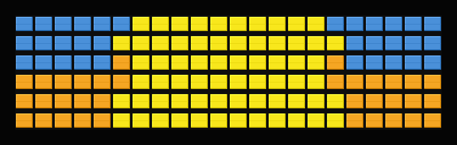
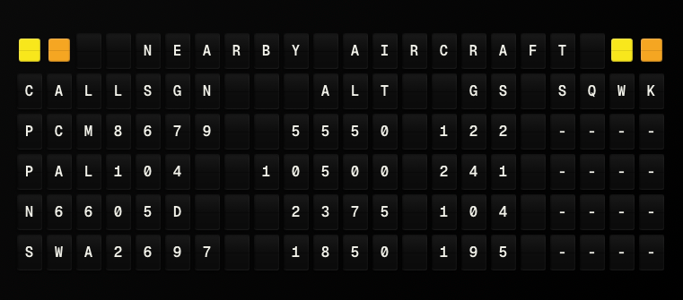
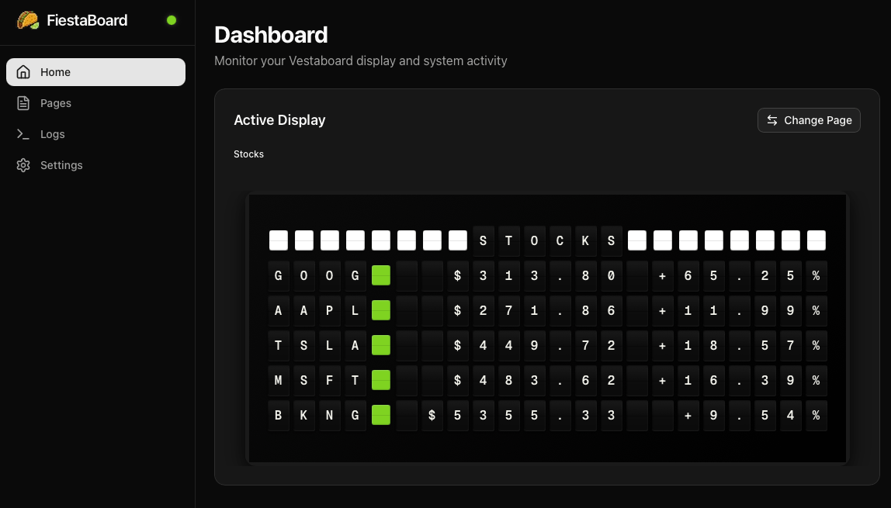

FiestaBoard is launching!

We've been working on this for a while and want to finally put it out there: FiestaBoard is a free way to turn your Vestaboard into a live dashboard that shows whatever you care about — weather, your commute, stocks, or even Star Trek quotes.

<!-- truncate -->

## What your board can show

You pick what you want: weather, date & time, transit (e.g. Muni), traffic, bike share, surf conditions, stocks, sports scores, air quality, what's playing on Last.fm, or fun stuff like Star Trek quotes and a sun-based art display. You can mix and match, and change what's on the board at different times (e.g. commute in the morning, weather in the evening).

## Controlling it

There's a simple page you open in your browser to choose what's on the board, add or change "pages," and start or stop the updates. No need to use the command line for day-to-day use.

## Getting started

Everything runs in Docker (good for a Raspberry Pi, NAS, or a computer that's always on). The repo has a step-by-step setup guide and a beginner's guide if you're new to this. You'll add your Vestaboard key and any optional API keys (e.g. for weather), then you're good to go.

Repo: https://github.com/Fiestaboard/FiestaBoard

It's open source (MIT license), so you can use it, change it, and share it freely. Fair warning: there are still bugs — we're working on it in our free time and things will improve over time. We welcome contributions and suggestions; the best place for those is [GitHub](https://github.com/Fiestaboard/FiestaBoard/issues) (issues or discussions), so they're in one place and others can benefit too.

We built it with San Francisco in mind (Muni, Bay Wheels, traffic) but you can set it up for anywhere. If you give it a try, we'd love to hear what you'd want to see on your board.
