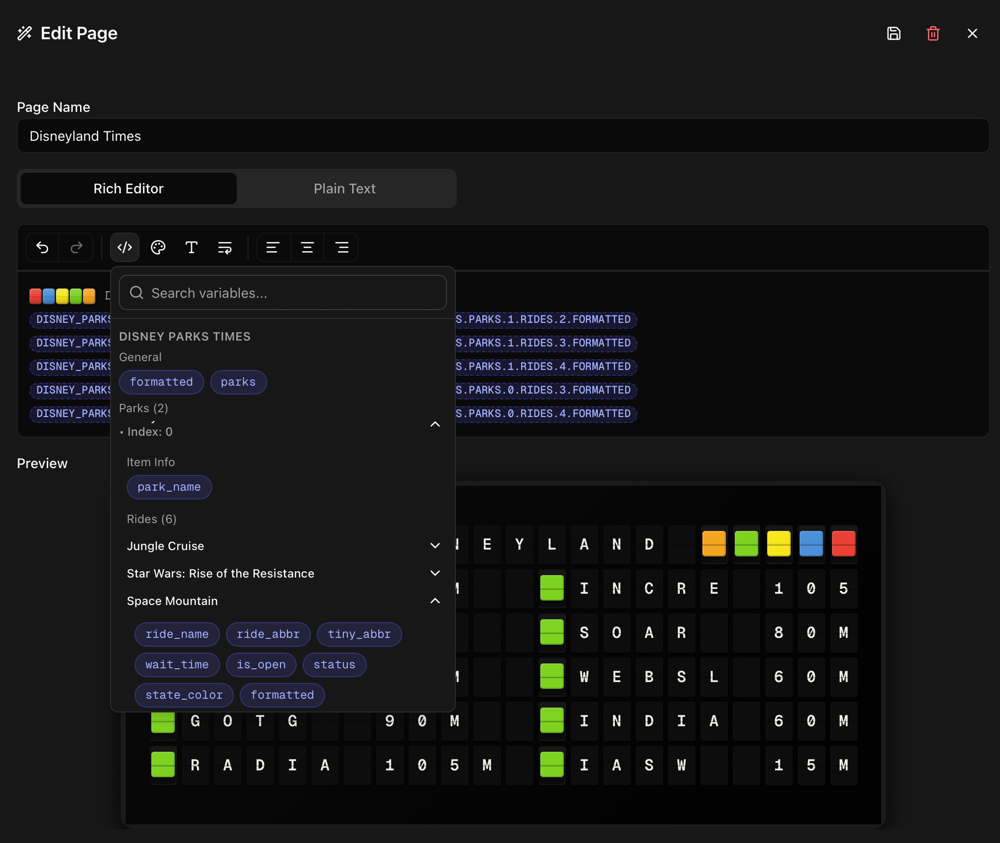
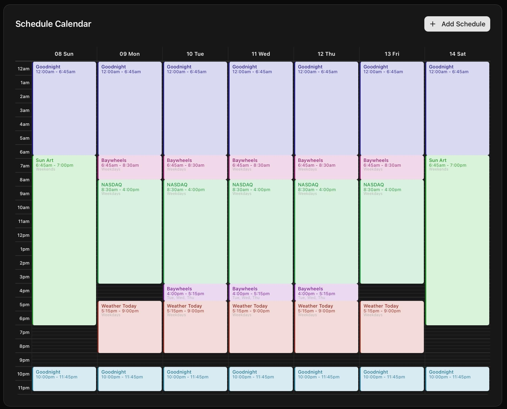
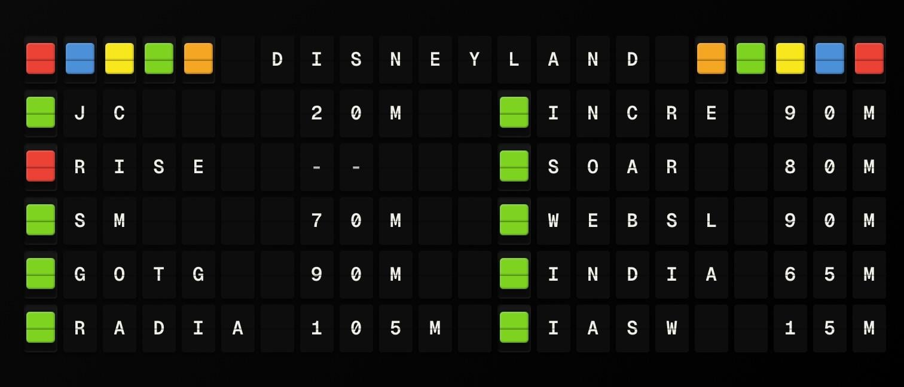

Hi friends,

We've been working on FiestaBoard — the free, open-source web dashboard for Vestaboard ([see the launch announcement](/blog/introducing-fiestaboard)) — to make managing the board grid a bit more flexible. We just pushed a major update and wanted to share the new features with the community!

<!-- truncate -->

If you're looking for more "pixel-perfect" control or specific automation, here is what's new:

## New Rich WYSIWYG Editor

No more guessing. The new editor gives you a real-time preview of the Vestaboard grid. You can "paint" individual bits, toggle colors, and align text exactly where you want it before sending it to your board.

## Scheduling Mode

You can now schedule specific messages or layouts to trigger at set times. Perfect for recurring morning greetings, "Meeting in Progress" signs, or daily reminders.

## Disney Parks Plugin

By popular request, we've added a plugin that pulls real-time queue times for Disney Parks. You can now turn your board into a live wait-time tracker.

Check it out on GitHub: https://github.com/Fiestaboard/FiestaBoard

We'd love to hear what you think! If you have ideas for new plugins or features you'd like to see added to the dashboard, let us know on [GitHub](https://github.com/Fiestaboard/FiestaBoard/issues) or [Discord](https://discord.gg/2GAqKnRF6h). As always: we know there are some bugs here and there — we fix them as fast as we can in our free time.

Happy flipping!
